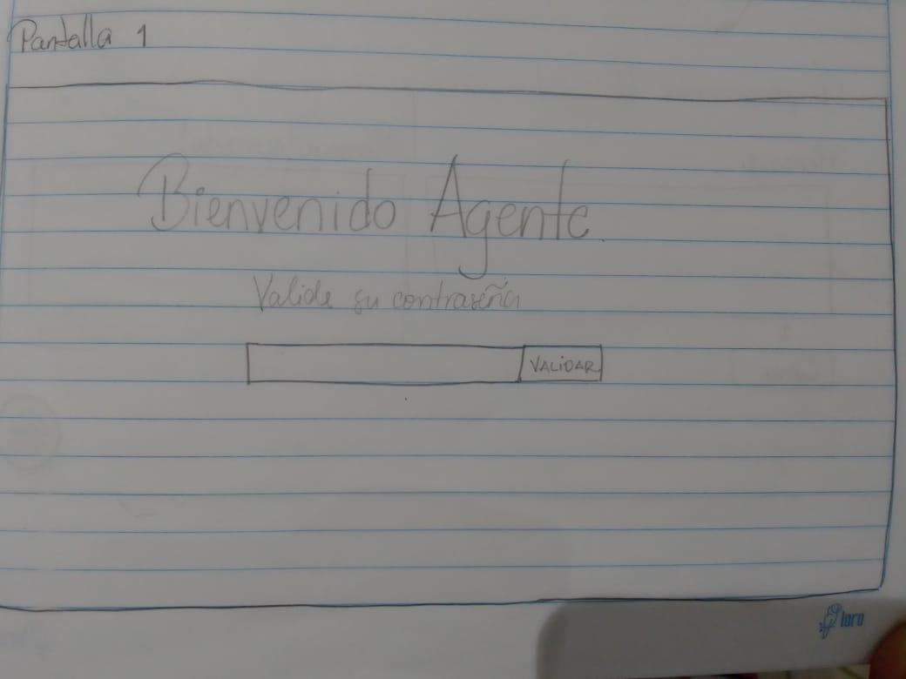
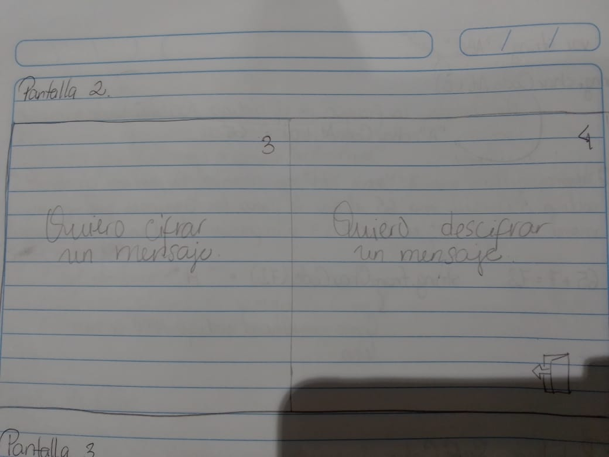
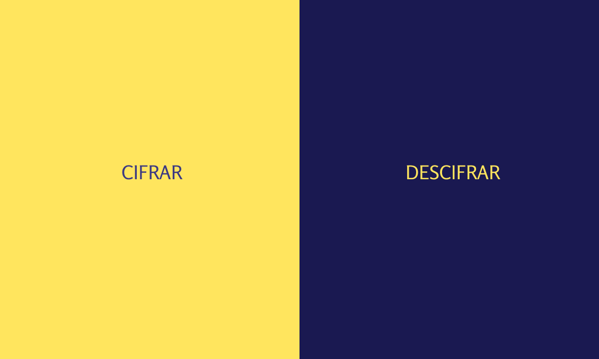
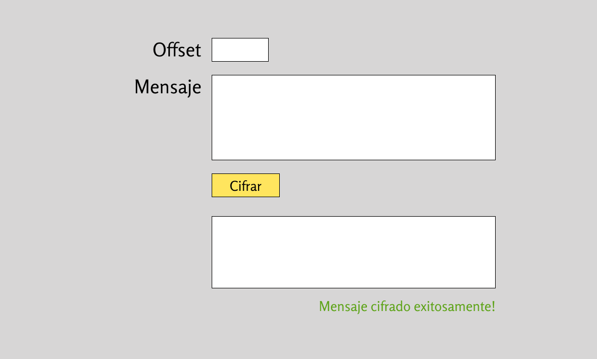
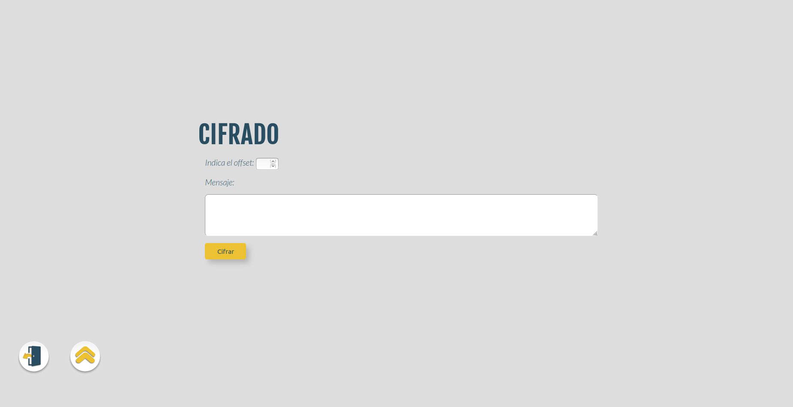

# Cifrado César

## Índice

* [1. Cifrado de César para agentes de investigación privada](#1-Cifrado-de-César-para-agentes-de-investigación-privada)
* [2. Resumen del proyecto](#2-resumen-del-proyecto)
* [3. Requerimientos de descargas del proyecto](#3-Requerimientos-de-descargas-del-proyecto)
* [4. Prototipos y producto final](#4-Prototipos-y-producto-final)
* [5. Resúmen del feedback recibido](#5-Resúmen-del-feedback-recibido)

***

## 1. Cifrado de César para agentes de investigación privada

Cifrar significa codificar. El [cifrado César](https://en.wikipedia.org/wiki/Caesar_cipher)
es uno de los primeros métodos de cifrado conocidos. El emperador romano Julio
César lo usaba para enviar órdenes secretas a sus generales en los campos de
batalla.

El cifrado césar es una de las técnicas más simples para cifrar un mensaje. Es
un tipo de cifrado por sustitución, es decir que cada letra del texto original
es reemplazada por otra que se encuentra un número fijo de posiciones
(desplazamiento) más adelante en el mismo alfabeto.

Por ejemplo, si usamos un desplazamiento (_offset_) de 3 posiciones:

* La letra A se cifra como D.
* La palabra CASA se cifra como FDVD.
* Alfabeto sin cifrar: A B C D E F G H I J K L M N O P Q R S T U V W X Y Z
* Alfabeto cifrado: D E F G H I J K L M N O P Q R S T U V W X Y Z A B C

En la actualidad, todos los cifrados de sustitución simple se descifran con
mucha facilidad y, aunque en la práctica no ofrecen mucha seguridad en la
comunicación por sí mismos; el cifrado César sí puede formar parte de sistemas
más complejos de codificación, como el cifrado Vigenère, e incluso tiene
aplicación en el sistema ROT13.

## 2. Resumen del proyecto

En la aplicación web desarrollada el usuario puede ingresar mediante una contraseña; posteriormente 
podrá elegir si desea Cifrar un mensaje o Descifrarlo, los valores a ingresar son el desplazamiento y el 
mensaje a cifrar/descifar.

Esta aplicación es pensada para agencias de investigaciones privadas; que por sus políticas de trabajo requieren este servicio. De este modo los usuarios directos son investigadores que por fines de seguridad se comunican entre ellos y con mensajeros por medio de mensajes cifrados. Su objetivo principal al emplear esta herramienta es mantener la confidencialidad de sus investigaciones. Por consiguiente se evita el filtrado de información delicada y privada de sus clientes.

## 3. Requerimientos de descargas del proyecto

* Es necesario tener un editor de código; el de su preferencia (visual estudio, atom)
* Si su Sistema Operativo es W  indows será necesario la instalación de una interfaz de terminal [UNIX Shell](https://github.com/Laboratoria/bootcamp/tree/master/topics/shell) puedes usar la versión completa de [Cmder](https://cmder.net/)
  que incluye [Git bash](https://git-scm.com/download/win) y si tienes Windows 10
  o superior puedes usar [Windows Subsystem for Linux](https://docs.microsoft.com/en-us/windows/wsl/install-win10).
* Del mismo modo debes tener git instalado.
* Forkea el proyecto.
* Clona tu fork de manera local (en tu compuradora)
* Instala las dependencias del proyecto con el comando npm install. Esto asume que has instalado Node.js (que incluye npm).
* Para ver la interfaz de tu programa en el navegador, usa el comando npm start para arrancar el servidor web y dirígete a http://localhost:5000 en tu navegador.

## 4. Prototipos y producto final

### Prototipo en papel

### Prototipo en figma

### Prototipo implementado 

## 5. Resúmen del feedback recibido 
En los prototipos presentados se fue implementando mejoras sugeridas, como la implementación de botones para movilización dentro de la página y la mejora del uso de los colores en los **Call to actions**.

